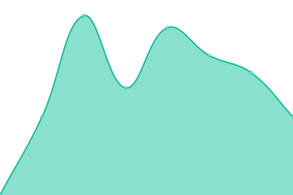
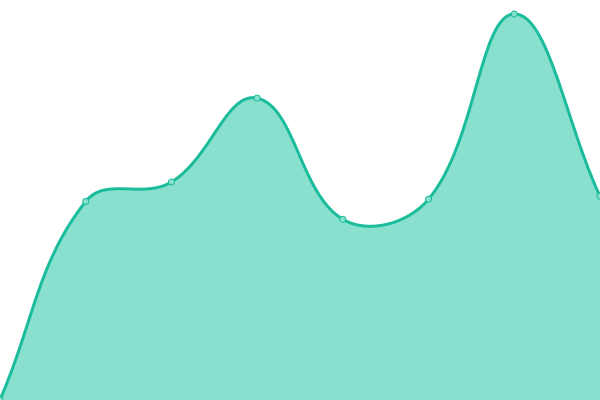

# [📈 Live Status](https://status.kickern.app): <!--live status--> **🟩 All systems operational**

This repository contains the open-source uptime monitor and status page for [kickern](https://status.kickern.app), powered by [Upptime](https://github.com/upptime/upptime).

With [Upptime](https://upptime.js.org), you can get your own unlimited and free uptime monitor and status page, powered entirely by a GitHub repository. We use [Issues](https://github.com/kickern/status/issues) as incident reports, [Actions](https://github.com/kickern/status/actions) as uptime monitors, and [Pages](https://status.kickern.app) for the status page.

<!--start: status pages-->
<!-- This summary is generated by Upptime (https://github.com/upptime/upptime) -->
<!-- Do not edit this manually, your changes will be overwritten -->
<!-- prettier-ignore -->
| URL | Status | History | Response Time | Uptime |
| --- | ------ | ------- | ------------- | ------ |
|  [Push Service](https://push.kickern.online/health) | 🟩 Up | [push-service.yml](https://github.com/kickern/status/commits/HEAD/history/push-service.yml) | 

 428ms
     
 | 

<a href="https://status.kickern.app/history/push-service">100.00%</a>
    

|  [Website](https://kickern.app) | 🟩 Up | [website.yml](https://github.com/kickern/status/commits/HEAD/history/website.yml) | 

 582ms
     
 | 

<a href="https://status.kickern.app/history/website">100.00%</a>
    

|  [DTFB (DE)](https://dtfb.de) | 🟩 Up | [dtfb-de.yml](https://github.com/kickern/status/commits/HEAD/history/dtfb-de.yml) | 

 1590ms
     
 | 

<a href="https://status.kickern.app/history/dtfb-de">100.00%</a>
    

|  [TFVSH (DE)](https://tfvsh.de) | 🟩 Up | [tfvsh-de.yml](https://github.com/kickern/status/commits/HEAD/history/tfvsh-de.yml) | 

 1023ms
     
 | 

<a href="https://status.kickern.app/history/tfvsh-de">100.00%</a>
    

|  [TFVHH (DE)](https://kickern-hamburg.de) | 🟩 Up | [tfvhh-de.yml](https://github.com/kickern/status/commits/HEAD/history/tfvhh-de.yml) | 

 873ms
     
 | 

<a href="https://status.kickern.app/history/tfvhh-de">100.00%</a>
    

|  [NTFV (DE)](https://ntfv.de) | 🟩 Up | [ntfv-de.yml](https://github.com/kickern/status/commits/HEAD/history/ntfv-de.yml) | 

 2180ms
     
 | 

<a href="https://status.kickern.app/history/ntfv-de">100.00%</a>
    

|  [TFVB (DE)](https://tfvb.de/) | 🟩 Up | [tfvb-de.yml](https://github.com/kickern/status/commits/HEAD/history/tfvb-de.yml) | 

 945ms
     
 | 

<a href="https://status.kickern.app/history/tfvb-de">100.00%</a>
    

|  [NWTFV (DE)](https://nwtfv.com) | 🟩 Up | [nwtfv-de.yml](https://github.com/kickern/status/commits/HEAD/history/nwtfv-de.yml) | 

 3150ms
     
 | 

<a href="https://status.kickern.app/history/nwtfv-de">97.55%</a>
    

|  [STFV (DE)](https://stfv.de) | 🟩 Up | [stfv-de.yml](https://github.com/kickern/status/commits/HEAD/history/stfv-de.yml) | 

 912ms
     
 | 

<a href="https://status.kickern.app/history/stfv-de">100.00%</a>
    

|  [NTVB (NL)](https://tafelvoetbal.nl) | 🟩 Up | [ntvb-nl.yml](https://github.com/kickern/status/commits/HEAD/history/ntvb-nl.yml) | 

 1456ms
     
 | 

<a href="https://status.kickern.app/history/ntvb-nl">100.00%</a>
    

<!--end: status pages-->

[**Visit our status website →**](https://status.kickern.app)

## 📄 License

- Powered by: [Upptime](https://github.com/upptime/upptime)
- Code: [MIT](./LICENSE) © [Anand Chowdhary](https://anandchowdhary.com), supported by [Pabio](https://pabio.com)
- Data in the `./history` directory: [Open Database License](https://opendatacommons.org/licenses/odbl/1-0/)
