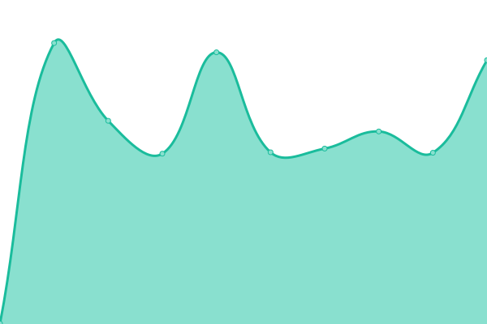

# [📈 Live Status](https://status.kickern.app): <!--live status--> **🟩 All systems operational**

This repository contains the open-source uptime monitor and status page for [kickern](https://status.kickern.app), powered by [Upptime](https://github.com/upptime/upptime).

With [Upptime](https://upptime.js.org), you can get your own unlimited and free uptime monitor and status page, powered entirely by a GitHub repository. We use [Issues](https://github.com/kickern/status/issues) as incident reports, [Actions](https://github.com/kickern/status/actions) as uptime monitors, and [Pages](https://status.kickern.app) for the status page.

<!--start: status pages-->
<!-- This summary is generated by Upptime (https://github.com/upptime/upptime) -->
<!-- Do not edit this manually, your changes will be overwritten -->
<!-- prettier-ignore -->
| URL | Status | History | Response Time | Uptime |
| --- | ------ | ------- | ------------- | ------ |
|  [Push Service](https://push.kickern.online/health) | 🟩 Up | [push-service.yml](https://github.com/kickern/status/commits/HEAD/history/push-service.yml) | 

 338ms
     
 | 

<a href="https://status.kickern.app/history/push-service">100.00%</a>
    

|  [DTFB](https://dtfb.de) | 🟩 Up | [dtfb.yml](https://github.com/kickern/status/commits/HEAD/history/dtfb.yml) | 

 0ms
     
 | 

<a href="https://status.kickern.app/history/dtfb">100.00%</a>
    

|  [TFVHH](https://kickern-hamburg.de) | 🟩 Up | [tfvhh.yml](https://github.com/kickern/status/commits/HEAD/history/tfvhh.yml) | 

 762ms
     
 | 

<a href="https://status.kickern.app/history/tfvhh">100.00%</a>
    

|  [NWTFV](https://nwtfv.com) | 🟩 Up | [nwtfv.yml](https://github.com/kickern/status/commits/HEAD/history/nwtfv.yml) | 

 691ms
     
 | 

<a href="https://status.kickern.app/history/nwtfv">100.00%</a>
    

|  [NTFV](https://ntfv.de) | 🟩 Up | [ntfv.yml](https://github.com/kickern/status/commits/HEAD/history/ntfv.yml) | 

 1875ms
     
 | 

<a href="https://status.kickern.app/history/ntfv">100.00%</a>
    

<!--end: status pages-->

[**Visit our status website →**](https://status.kickern.app)

## 📄 License

- Powered by: [Upptime](https://github.com/upptime/upptime)
- Code: [MIT](./LICENSE) © [Anand Chowdhary](https://anandchowdhary.com), supported by [Pabio](https://pabio.com)
- Data in the `./history` directory: [Open Database License](https://opendatacommons.org/licenses/odbl/1-0/)
